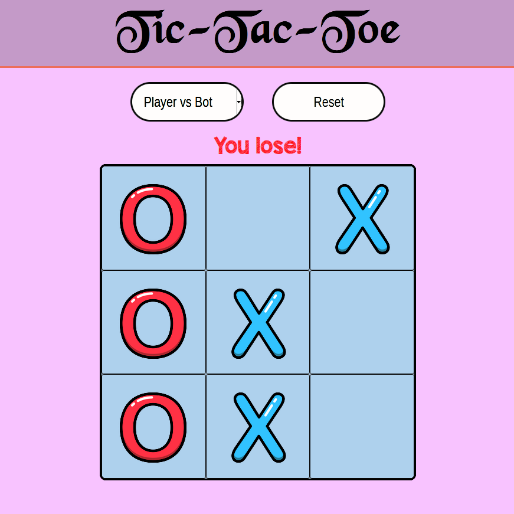

# Tic-Tac-Toe

## Live at: https://truongwerk.github.io/Tic-Tac-Toe/

## This project is a practice about factory functions and the module pattern in JavaScript.

## Feature:

### - Have two modes:

- Player vs Player.
- Player vs Bot.

### - Unbeatable bot width MiniMax algorithm
